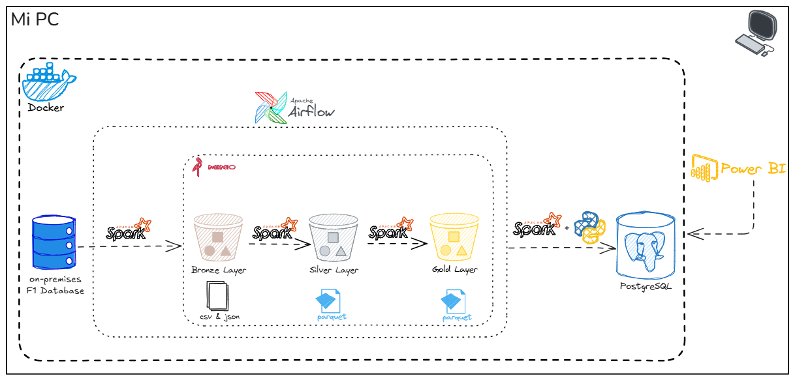

# F1-DataEng-Project 🏎️ 🏁
(🛠️⚠️ en desarrollo...)

Este proyecto es una solución End-to-End de Ingeniería de Datos inspirada en la Fórmula 1, que integra múltiples tecnologías open source para la ingesta, procesamiento, almacenamiento y análisis de datos. Está diseñado con un enfoque escalable y modular, lo que permite ejecutarlo en entornos locales con Docker y, al mismo tiempo, migrarlo fácilmente a la nube (AWS u otros proveedores).

## 🏗️ Arquitectura del Proyecto



## Prerequisitos
...

## Instalación
1. Crear las siguientes carpetas a la misma altura del `docker-compose.yml`.

```bash
mkdir -p ./dags ./logs ./plugins ./config ./scripts ./spark_drivers ./data/{raw,staging,processed} ./database
```

2. Para evitar problemas de permisos en los volumenes de logs y data, solución recomendada:
```bash 
sudo chown -R 50000:50000 ./logs
sudo chown -R 50000:50000 ./data
```

3. Crear un archivo con variables de entorno llamado `.env` ubicado a la misma altura que el `docker-compose.yml`. Cuyo contenido sea:

```bash
# Variables para Airflow
AIRFLOW_UID=50000

# Variables para Postgres
POSTGRES_HOST=postgres # YOUR_POSTGRES_HOST
POSTGRES_PORT=5432 # YOUR_POSTGRES_PORT
POSTGRES_DB=postgres # YOUR_POSTGRES_DB
POSTGRES_SCHEMA=public # YOUR_POSTGRES_SCHEMA
POSTGRES_USER=airflow # YOUR_POSTGRES_USER
POSTGRES_PASSWORD=airflow # YOUR_POSTGRES_PASSWORD
POSTGRES_URL="jdbc:postgresql://${POSTGRES_HOST}:${POSTGRES_PORT}/${POSTGRES_DB}?user=${POSTGRES_USER}&password=${POSTGRES_PASSWORD}"
DRIVER_PATH=/tmp/drivers/postgresql-42.5.2.jar,/tmp/drivers/mysql-connector-j-8.0.32.jar,/tmp/drivers/hadoop-aws-3.3.1.jar,/tmp/drivers/aws-java-sdk-bundle-1.11.375.jar

F1_DW=f1_dw
BRONZE_SCHEMA=f1_bronze
SILVER_SCHEMA=f1_silver
GOLD_SCHEMA=f1_gold
STG_SCHEMA=f1_stg

# Variables para MySQL
MYSQL_ROOT_PASSWORD=rootpassword
MYSQL_DATABASE=f1db
MYSQL_USER=f1user
MYSQL_PASSWORD=f1password
MYSQL_PORT=3306
MYSQL_HOST=mysql

# Variables para MinIO
MINIO_ROOT_USER=minio
MINIO_ROOT_PASSWORD=minio123


# Variables para Notebooks
DATA_SOURCE="f1db"
DATA_SOURCE_MANUAL="Carga manual - "
DATA_SOURCE_API="Ergast API"
BRONZE_LAYER_PATH="s3a://bronze"
SILVER_LAYER_PATH="s3a://silver"
GOLD_LAYER_PATH="s3a://gold"
```

4. Descargar Drivers JDBC y JARs

Ir el directorio `spark_drivers` y descargar los JARs necesarios:

```bash
cd /spark_drivers
```

Ejecutar los siguientes comandos para descargar los drivers:

```bash
wget https://repo1.maven.org/maven2/org/postgresql/postgresql/42.5.2/postgresql-42.5.2.jar
wget https://repo1.maven.org/maven2/com/mysql/mysql-connector-j/8.0.32/mysql-connector-j-8.0.32.jar
wget https://repo1.maven.org/maven2/org/apache/hadoop/hadoop-aws/3.3.1/hadoop-aws-3.3.1.jar
wget https://repo1.maven.org/maven2/com/amazonaws/aws-java-sdk-bundle/1.11.375/aws-java-sdk-bundle-1.11.375.jar
```

5. Descargar las imagenes de Airflow y Spark. En caso de error al descargar las imagenes, debe hacer un login en DockerHub.
```bash
docker pull lpoletto/airflow:airflow_2_6_2
docker pull lpoletto/spark:spark_3_4_1
```

6. Las imagenes fueron generadas a partir de los Dockerfiles ubicados en `docker_images/`. Si se desea generar las imagenes nuevamente, ejecutar los comandos que están en los Dockerfiles.

7. Ejecutar el siguiente comando para levantar los servicios de Airflow y Spark.
```bash
docker-compose up -d
```

8. Una vez que los servicios estén levantados, ingresar a Airflow en `http://localhost:8080/`.

9. En la pestaña `Admin -> Connections` crear una nueva conexión con los siguientes datos para Postgres:
    * Conn Id: `postgres_default`
    * Conn Type: `Postgres`
    * Host: `postgres` (El nombre del servicio de PostgreSQL (ej. *postgres*), o *host.docker.internal* si la base de datos está fuera de la red Docker.)
    * Schema(Database): `nombre de la db de Postgres`
    * User: `usuario de Postgres`
    * Password: `contraseña de Postgres`
    * Port: `5432`

    Si desea crear una conexión para MySQL, los pasos son similares.

10. En la pestaña `Admin -> Connections` crear una nueva conexión con los siguientes datos para Spark:
    * Conn Id: `spark_default`
    * Conn Type: `Spark`
    * Host: `spark://spark`
    * Port: `7077`
    * Extra: `{"queue": "default"}`

11. En la pestaña `Admin -> Variables` crear una nueva variable con los siguientes datos:
    * Key: `driver_class_path`
    * Value: `/tmp/drivers/postgresql-42.5.2.jar:/tmp/drivers/mysql-connector-j-8.0.32.jar:/tmp/drivers/hadoop-aws-3.3.1.jar:/tmp/drivers/aws-java-sdk-bundle-1.11.375.jar`

12. En la pestaña `Admin -> Variables` crear una nueva variable con los siguientes datos:
    * Key: `spark_scripts_dir`
    * Value: `/opt/airflow/scripts`

13. En la pestaña `Admin -> Variables` crear las variables con los siguientes datos:
    * Key: `raw_data_dir`
    * Value: `/opt/airflow/data/raw`
    * Key: `staging_data_dir`
    * Value: `/opt/airflow/data/staging`
    * Key: `processed_data_dir`
    * Value: `/opt/airflow/data/processed`

14. Ejecutar los DAGs.

## Comando utilies de Docker
Si experimienta algun fallo o que no se visualice algun dag, reiniciar los servicios:
```bash
docker compose down
docker compose up -d
```

Si cambió algo en el `docker-compose.yml`, entonces:
```bash
docker compose down
docker compose up -d --build
```

Si desea volver a generar todos los servicios con sus volumenes:
```bash
docker compose down -v
docker compose up -d
```