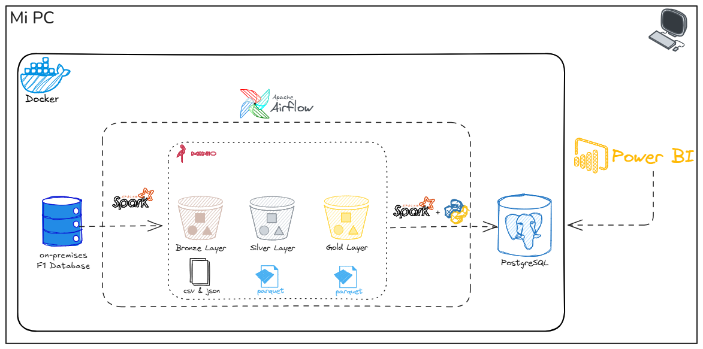
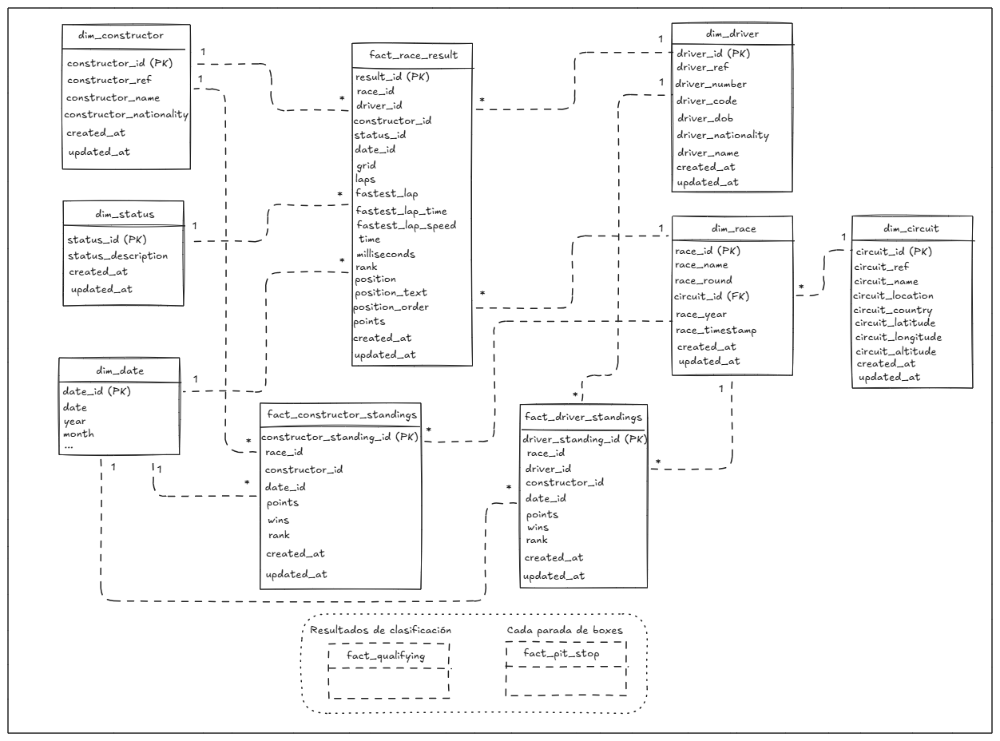

# F1-DataEng-Project 🏎️ 🏁

Solución End-to-End de Ingeniería de Datos inspirada en la Fórmula 1, integrando tecnologías open source para ingesta, procesamiento, almacenamiento y análisis de datos. El diseño es escalable y modular, permitiendo ejecución local con Docker y fácil migración a la nube (AWS u otros).

---

## 🏗️ Arquitectura del Proyecto



---


## 📋 Prerrequisitos

- VsCode o cualquier editor de código.
- [PgAdmin](https://www.pgadmin.org/) o [DBeaver](https://dbeaver.io/)
- Docker y Docker Compose instalados.
- Acceso a DockerHub para descargar imágenes.
- Conexión a internet para descargar drivers y dependencias.
- Configurar servidor SMPT de Gmail para enviar correos. Link: [Enviar correos con el servidor SMTP de Gmail](https://support.google.com/a/answer/176600?hl=es)
---

## ⚠️ Configuración del archivo `.env`

Antes de levantar los servicios, revisa y modifica las variables sensibles en el archivo `.env`:

- Cambia las contraseñas, usuarios y correos por valores seguros y propios.
- No compartas el archivo `.env` con credenciales reales en repositorios públicos.

---

## 🔌 Configuración de Puertos

Asegúrate de que los siguientes puertos estén libres en tu máquina local antes de iniciar los servicios:

- Airflow: 8080
- MinIO Console: 9001
- MinIO API: 9000
- Spark: 7077
- Postgres: 5432
- MySQL: 3306
- Jupyter Lab: 8888

Si algún puerto está ocupado, modifícalo en el `docker-compose.yml` y en las variables de entorno correspondientes.

---

## 🛠️ Servicios y Puertos

Una vez levantados los servicios, estarán disponibles en:

| Servicio         | Puerto | URL                              | Credenciales                              |
|------------------|--------|----------------------------------|-------------------------------------------|
| Airflow Web UI   | 8080   | [http://localhost:8080](http://localhost:8080) | User: `airflow` / Pass: `airflow`         |
| Jupyter Lab      | 8888   | [http://localhost:8888](http://localhost:8888/?token=dev) | Token: `dev`                              |
| MinIO Console    | 9001   | [http://localhost:9001](http://localhost:9001) | User: `minio` / Pass: `minio123`          |
| MinIO API        | 9000   | [http://localhost:9000](http://localhost:9000) | -                                         |
| PostgreSQL       | 5432   | `localhost:5432`                  | User: `airflow` / Pass: `airflow`          |
| MySQL            | 3306   | `localhost:3306`                  | User: `f1user` / Pass: `f1password`        |

---

## 🗝️ Credenciales de Ejemplo

**Airflow:**
- Usuario: `airflow`
- Contraseña: `airflow`

**MinIO:**
- Usuario: `minio`
- Contraseña: `minio123`

**Jupyter Lab:**
- Token: `dev`

**Postgres:**
- Usuario: `airflow`
- Contraseña: `airflow`

**MySQL:**
- Usuario: `f1user`
- Contraseña: `f1password`

Modifica estos valores en `.env` y en las interfaces de conexión según tus necesidades.

---

## 📚 Referencias y Documentación Oficial

- [Apache Airflow](https://airflow.apache.org/docs/)
- [Apache Spark](https://spark.apache.org/docs/latest/)
- [MinIO](https://min.io/docs/minio/linux/index.html)
- [Docker](https://docs.docker.com/)
- [PostgreSQL](https://www.postgresql.org/docs/)
- [MySQL](https://dev.mysql.com/doc/)

Consulta estos enlaces para detalles avanzados y solución de problemas.

---

## 🚀 Instalación

1. **Crear carpetas necesarias**  
   Ejecuta en la raíz del proyecto:
   ```bash
   mkdir -p ./dags ./logs ./plugins ./config ./scripts ./spark_drivers ./data/{raw,staging,processed} ./database
   ```

2. **Permisos recomendados para logs y data**  
   ```bash
   sudo chown -R 50000:50000 ./logs
   sudo chown -R 50000:50000 ./data
   ```

3. **Crear archivo `.env`**  
   Ubícalo junto a `docker-compose.yml` con el siguiente contenido:
   ```bash
   # Variables para Airflow
   AIRFLOW_UID=50000

   # Variables para Postgres
   POSTGRES_HOST=postgres
   POSTGRES_PORT=YOUR_POSTGRES_PORT
   POSTGRES_DB=YOUR_POSTGRES_DB
   POSTGRES_SCHEMA=YOUR_POSTGRES_SCHEMA
   POSTGRES_USER=YOUR_POSTGRES_USER
   POSTGRES_PASSWORD=YOUR_POSTGRES_PASSWORD
   POSTGRES_URL="jdbc:postgresql://${POSTGRES_HOST}:${POSTGRES_PORT}/${POSTGRES_DB}?user=${POSTGRES_USER}&password=${POSTGRES_PASSWORD}"
   DRIVER_PATH=/tmp/drivers/postgresql-42.5.2.jar,/tmp/drivers/mysql-connector-j-8.0.32.jar,/tmp/drivers/hadoop-aws-3.3.1.jar,/tmp/drivers/aws-java-sdk-bundle-1.11.375.jar

   F1_DWH=f1_dwh
   BRONZE_SCHEMA=f1_bronze
   SILVER_SCHEMA=f1_silver
   GOLD_SCHEMA=f1_gold
   STG_SCHEMA=f1_stg

   # Variables para MySQL
   MYSQL_ROOT_PASSWORD=rootpassword
   MYSQL_DATABASE=f1db
   MYSQL_USER=f1user
   MYSQL_PASSWORD=f1password
   MYSQL_PORT=3306
   MYSQL_HOST=mysql

   # Variables para MinIO
   MINIO_ROOT_USER=minio
   MINIO_ROOT_PASSWORD=minio123


   # Variables para Notebooks
   DATA_SOURCE="f1db"
   DATA_SOURCE_MANUAL="Carga manual - "
   DATA_SOURCE_API="Ergast API"
   BRONZE_LAYER_PATH="s3a://bronze"
   SILVER_LAYER_PATH="s3a://silver"
   GOLD_LAYER_PATH="s3a://gold"

   # Variables para SMTP
   SMTP_HOST=smtp.gmail.com
   SMTP_PORT=587
   SMTP_USER=tu_mail@gmail.com
   SMTP_PASSWORD="tu_app_password_de_16_caracteres"
   SMTP_MAIL_FROM=tu_mail@gmail.com

   # Variables para JupyterPySpark
   JUPYTER_ENABLE_LAB='1'
   JUPYTER_TOKEN='dev'
   NB_USER=dev
   NB_GID=1000
   CHOWN_HOME='yes'
   CHOWN_HOME_OPTS='-R'
   ```

4. Descargar Drivers JDBC y JARs

Crear el directorio `spark_drivers` y descargar los JARs necesarios:

```bash
mkdir spark_drivers
cd /spark_drivers
```

Ejecuta los siguientes comandos para descargar los drivers:

```bash
wget https://repo1.maven.org/maven2/org/postgresql/postgresql/42.5.2/postgresql-42.5.2.jar
wget https://repo1.maven.org/maven2/com/mysql/mysql-connector-j/8.0.32/mysql-connector-j-8.0.32.jar
wget https://repo1.maven.org/maven2/org/apache/hadoop/hadoop-aws/3.3.1/hadoop-aws-3.3.1.jar
wget https://repo1.maven.org/maven2/com/amazonaws/aws-java-sdk-bundle/1.11.375/aws-java-sdk-bundle-1.11.375.jar
```

5. **Descargar imágenes de Airflow y Spark**  
   Si hay error, haz login en DockerHub.
   ```bash
   docker pull lpoletto/airflow:airflow_2_6_2
   docker pull lpoletto/spark:spark_3_4_1
   ```

6. **(Opcional) Construir imágenes desde Dockerfiles**  
   Los Dockerfiles están en `docker_images/`.

7. **Levantar servicios**  
   ```bash
   docker-compose up -d
   ```

8. Una vez que los servicios estén levantados, ingresar a Airflow en `http://localhost:8080/`.

9. **Conexión a PostgreSQL**
En la pestaña `Admin -> Connections` crear una nueva conexión con los siguientes datos para Postgres:
    * Conn Id: `postgres_default`
    * Conn Type: `Postgres`
    * Host: `postgres` (El nombre del servicio de PostgreSQL (ej. *postgres*), o *host.docker.internal* si la base de datos está fuera de la red Docker.)
    * Schema(Database): `nombre de la db de Postgres`
    * User: `usuario de Postgres`
    * Password: `contraseña de Postgres`
    * Port: `5432`

10. **Conexión a MySQL**  
    - Similar a la anterior.

11. **Conexión a Spark**  
    - Conn Id: `spark_default`  
    - Conn Type: `Spark`  
    - Host: `spark://spark`  
    - Port: `7077`  
    - Extra: `{"queue": "default"}`

12. **Conexión a AWS S3 (MinIO)**  
    - Conn Id: `aws_default`  
    - Conn Type: `Amazon Web Services`  
    - AWS Access Key ID: `minio`  
    - AWS Secret Access Key: contraseña de MinIO  
    - Extra: `{"region_name": "us-east-1","endpoint_url": "http://minio:9000","use_ssl": false}`

13. **Conexión SMTP (Email)**  
    - Conn Id: `smtp_default`  
    - Conn Type: `Email`  
    - Host: `smtp.gmail.com`  
    - Login: `tu_mail@gmail.com`  
    - Password: `<tu_app_password_de_16_caracteres>`  
    - Port: `587`  
    - Extra: (vacío)

14. En la pestaña `Admin -> Variables` crear una nueva variable con los siguientes datos:
    * Key: `driver_class_path`
    * Value: `/tmp/drivers/postgresql-42.5.2.jar:/tmp/drivers/mysql-connector-j-8.0.32.jar:/tmp/drivers/hadoop-aws-3.3.1.jar:/tmp/drivers/aws-java-sdk-bundle-1.11.375.jar`

15. En la pestaña `Admin -> Variables` crear una nueva variable con los siguientes datos:
    * Key: `spark_scripts_dir`
    * Value: `/opt/airflow/scripts`

16. En la pestaña `Admin -> Variables` crear las variables con los siguientes datos:
    * Key: `raw_data_dir`
    * Value: `/opt/airflow/data/raw`
    * Key: `staging_data_dir`
    * Value: `/opt/airflow/data/staging`
    * Key: `processed_data_dir`
    * Value: `/opt/airflow/data/processed`

17. En la pestaña `Admin -> Variables` crear las variables con los siguientes datos:
    * Key: `dags_dir`
    * Value: `/opt/airflow/dags`

18. En la pestaña `Admin -> Variables` crear las variables con los siguientes datos:
    * Key: `gold_bucket_path`
    * Value: `s3a://gold`

19. En la pestaña `Admin -> Variables` crear las variables con los siguientes datos:
    * Key: `gold_bucket_name`
    * Value: `gold`

20. En la pestaña `Admin -> Variables` crear las variables con los siguientes datos:
    * Key: `end_date`
    * Value: `2024-11-23`

    **Nota:** Añadir cualquier otra variable que consideren necesaria para sus scripts o DAGs, dependiendo de los requerimientos específicos del proyecto.

21. Ejecutar el DAG: `start_up_init.py` para configurar el entorno de datos (db,schemas,buckets).

## 🐋 Comandos utilies de Docker
Si experimienta algun fallo o que no se visualice algun dag, reiniciar los servicios:
```bash
docker compose down
docker compose up -d
```

Si cambió algo en el `docker-compose.yml`, entonces:
```bash
docker compose down
docker compose up -d --build
```

Si desea volver a generar todos los servicios con sus volumenes:
```bash
docker compose down -v
docker compose up -d
```

---


## 📊 Consultas SQL de Ejemplo

### Esquema Copo de Nieve (Star Snowflake)



Ejemplos de queries para analizar los datos en las vistas del Data Warehouse:

### Campeonatos de pilotos por temporada

```sql
create or replace view f1_gold.vw_drivers_standings
as
select 
    d.date_id,
    d."year" as season,
    r.race_id,
    r.race_round,
    r.race_name,
    ds."rank" as pos,
    dr.driver_id,
    dr.driver_name as driver,
    ds.points -- Puntos acumulados hasta esa fecha  
from f1_gold.fact_driver_standings ds
left join f1_gold.dim_race r on ds.race_id = r.race_id
left join f1_gold.dim_date d on r.race_date = d."date" 
left join f1_gold.dim_driver dr on ds.driver_id = dr.driver_id
where r.race_round <> -1
order by season, r.race_round , points desc
```

### Campeonatos de constructores por temporada

```sql
CREATE OR REPLACE VIEW f1_gold.vw_constructor_standings
AS 
SELECT 
    d.date_id,
    d."year" as season,
    r.race_id,
    r.race_round,
    r.race_name,
    cs."rank" as pos,
    cs.constructor_id
    dc.constructor_name as team,
    cs.points -- Puntos acumulados hasta esa fecha  
FROM f1_gold.fact_constructor_standings cs
LEFT JOIN f1_gold.dim_race r ON cs.race_id = r.race_id
LEFT JOIN f1_gold.dim_date d ON r.race_date = d."date" 
LEFT JOIN f1_gold.dim_constructor dc ON cs.constructor_id = dc.constructor_id
WHERE r.race_round <> -1
ORDER BY season, r.race_round , points DESC
```

### Campeonatos de pilotos histórico

```sql
create or replace view vw_drivers_championships
as
with last_race_per_season AS (
    -- 1. Identificamos cuál es la última ronda (round) de cada año
    select 
        d."year" as season_year,
        MAX(r.race_round) as last_round
    from f1_gold.dim_race r
    inner join f1_gold.dim_date d on r.race_date = d."date" 
    group by d."year"
)
select count(*) total_champ, driver
from f1_gold.vw_drivers_standings ds
inner join last_race_per_season lr 
    on ds.season = lr.season_year and ds.race_round = lr.last_round
where pos = 1
group by driver
order by total_champ desc;
```

### Campeonatos de constructores histórico

```sql
create or replace view vw_constructors_championships
as
with last_race_per_season AS (
    select 
        d."year" as season_year,
        MAX(r.race_round) as last_round
    from f1_gold.dim_race r
    inner join f1_gold.dim_date d ON r.race_date = d."date" 
    group by d."year"
)
select count(*) total_champ, 
case 
	when trim(team) like '%Lotus%' then 'Lotus'
	else team
end as team
from f1_gold.vw_constructor_standings cs
inner join last_race_per_season lr 
    ON cs.season = lr.season_year and cs.race_round = lr.last_round
where pos = 1
group by 2
order by total_champ desc;
```

---

**Notas:**
- Revisa los valores de las variables y rutas según tu entorno.
- Consulta la documentación oficial de cada tecnología para detalles avanzados.

## 👥 Autor

- Lautaro G. Poletto
- 👉 [GitHub](https://github.com/lpoletto)
- 👉 [LinkedIn](https://www.linkedin.com/in/lautaro-poletto/)

## 📦 Recursos y Créditos

- [Ergast API](https://www.kaggle.com/datasets/jtrotman/formula-1-race-data) por proporcionar los datos de Fórmula 1
- Curso de Udemy [Azure Databricks & Spark For Data Engineers:Hands-on Project by Ramesh Retnasamy](https://www.udemy.com/share/104Rz63@ivD4mv9oQ4c1rWeWPH7FKhwYqyL__CqO5uVRBUvxzBnvR79hKgvzcKq3UUKxvNiz/)
- Curso de Udemy [Apache Airflow: The Hands-On Guide by Marc Lamberti](https://www.udemy.com/course/the-ultimate-hands-on-course-to-master-apache-airflow/)
